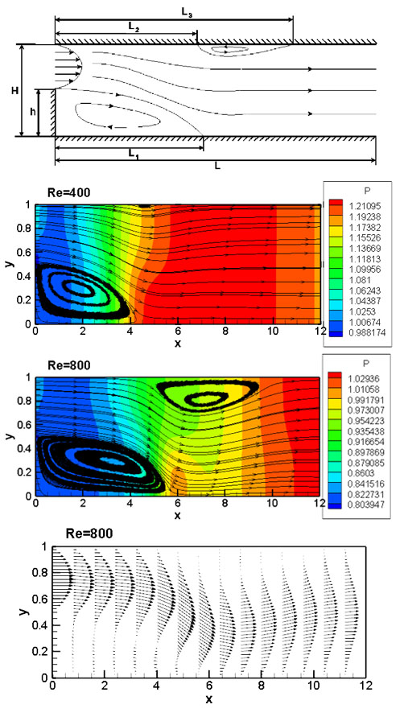

# Computational Fluid Dynamics

## Incompressible Viscous Flow
Backward Facing Step is a benchmark problem for validating such CFD methods. A finite volume method is used in this project. At Reynolds numbers above 1.0, a vortex forms just after the step. For Reynolds numbers above 400.0 a secondary vortex will be visible on the ceiling wall. Here we can see pressure contours and streamlines for Re=400 and Re=800 as well as velocity vectors for Re=800. 

