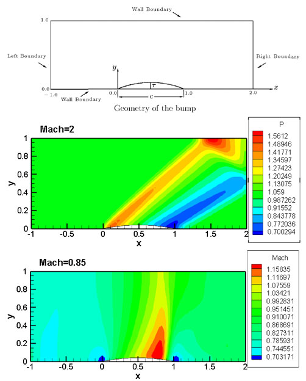
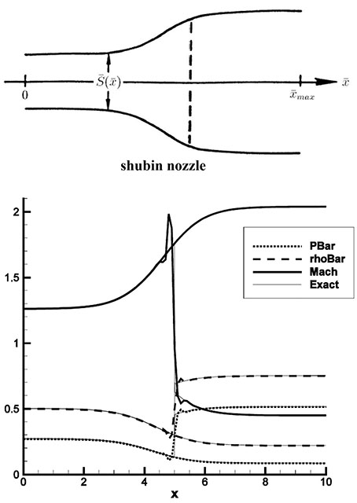
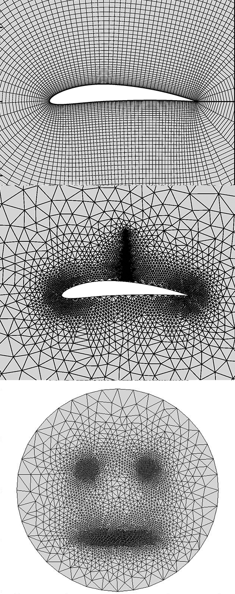

# Computational Fluid Dynamics

## Incompressible Viscous Flow
Backward Facing Step is a benchmark problem for validating such CFD methods. A finite volume method is used in this project. At Reynolds numbers above 1.0, a vortex forms just after the step. For Reynolds numbers above 400.0 a secondary vortex will be visible on the ceiling wall. Here we can see pressure contours and streamlines for Re=400 and Re=800 as well as velocity vectors for Re=800. 

## 2D Compressible Inviscid Flow 
This problem is solved in the domain over a bump using a finite volume method. The flow is considered inviscid and compressible, so there will be shocks in the flow field for a supersonic inlet flow, as well as a transonic inlet. [Jameson's method](https://www.sciencedirect.com/science/article/abs/pii/009630038390019X) is used to solve the governing equations with a 4th order Runge-Kutta method for time integration. Here we can see the geometry of the bump and the solution to inlet Mach numbers of 2.0 and 0.85 for the case of supersonic and transonic flows respectively.

## 1D Compressible Inviscid Flow
This problem is solved using a finite difference method. Here the flow is considered quasi 1-dimensional, inviscid and compressible. The fluid is flowing through a [Shubin nozzle](https://link.springer.com/chapter/10.1007%2F3-540-11948-5_44) with a known total pressure. The flow adapts to a known back pressure and there can be shocks in the flow field. The geometry of the nozzle and the scaled pressure, mach number and density plots as well as the exact solution for a supersonic inlet test case are shown here.

## Grid Generation
Generating the numerical grid is the first step for solving any CFD problem. The unstructured case was generated implementing the [Advancing Front](https://onlinelibrary.wiley.com/doi/abs/10.1002/nme.1620372103) method. The following image illustrates a structured mesh that was generated using a set of hyperbolic PDEs.

