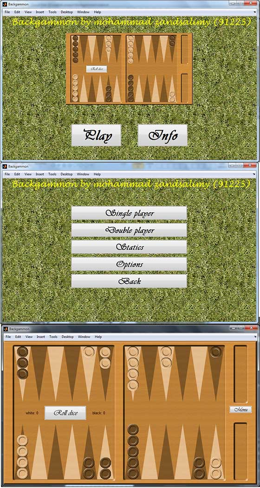

# MATLAB Programming

## Backgammon
This project implements a dynamic user interface with interesting layouts and a variety of game options such as sounds, showing legal moves, single/double player, statistics and more. Single player mode is where the magic happens. The AI is capable of moving the mouse cursor on his turn, and makes the right moves. This method is based on scoring all the possible moves and choosing the highest score as the optimal movement. The AI tries to make progress and at the same time does not letting the human win the game (legally, of course).

