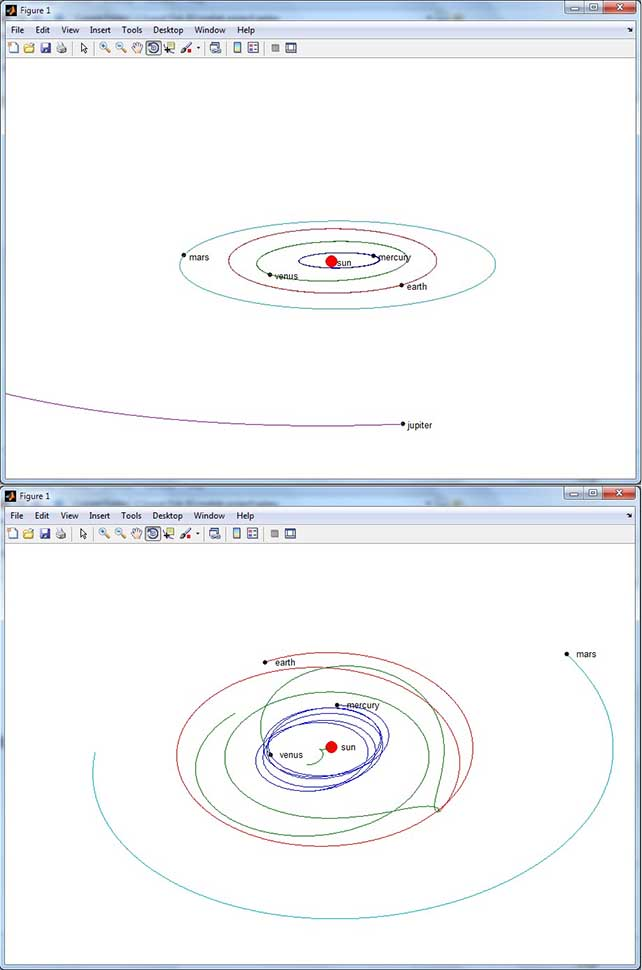

# MATLAB Programming

## Backgammon
This project implements a dynamic user interface with interesting layouts and a variety of game options such as sounds, showing legal moves, single/double player, statistics and more. Single player mode is where the magic happens. The AI is capable of moving the mouse cursor on his turn, and makes the right moves. This method is based on scoring all the possible moves and choosing the highest score as the optimal movement. The AI tries to make progress and at the same time does not let the human win the game (legally, of course).

## Solar System
This 3D simulation starts from the midnight of Feb 20, 2013. It is based on Newton's second law of motion and the gravity between all the planets are taken into account. So if for example we multiply the mass of earth by 10,000 the system will be changed in a horrific way as seen on the bottom image.

