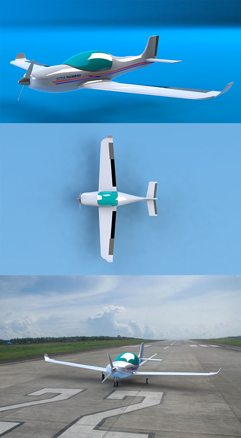
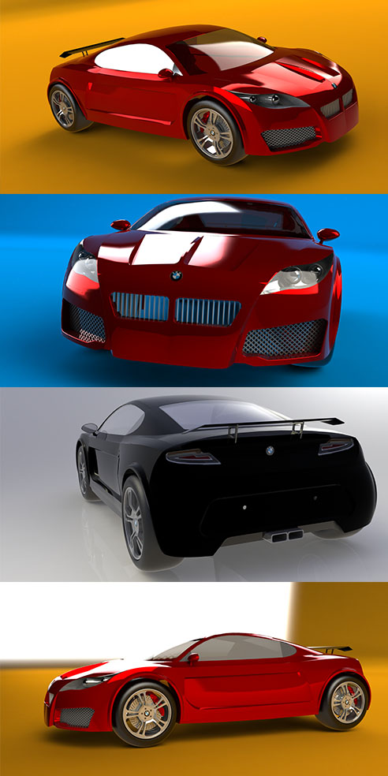

# CAD Design

## Royal Falcon-511
This is a two passenger airplane designed from scratch with preferred sizing based on [Airplane Design](https://www.google.ca/books/edition/_/6dAoSAAACAAJ?hl=en&sa=X&ved=2ahUKEwiBktLNuuTxAhVRuZ4KHa8CBkwQ7_IDegQICBAC) by Jan Roskam.

## Waste Sorting Device
This is a device designed for separating paper, aluminum, glass and plastic garbage. This device uses no electrical sensors.

##  Stem Cell Research
This device is used during stem cell research and is a main container for cells and a place to plant them.

##  Miscellaneous

## BMW concept

## Energy (designed by myself)

## Lamborghini Gallardo

## Shelby Mustang

## Chevrolet Camaro

